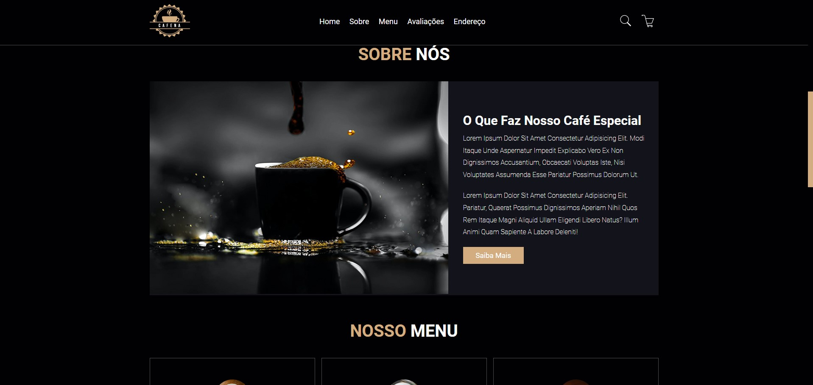

# Projeto Cafeteria
Bem-vindo ao projeto da Cafeteria! Este projeto foi desenvolvido com o objetivo de aplicar e aprimorar conhecimentos em HTML e CSS. O design foi pensado para proporcionar uma experiência visual agradável e intuitiva para os usuários.

## Tecnologias Utilizadas

### Front-End
- HTML
- CSS

## Página




### Instruções para Visualização do Projeto

1. **Basta utilizar esse link:** https://cafeteria-lake.vercel.app/

### OU

1. **Crie uma pasta em desktop**

2. **Utilizando o cmd vai até a pasta ou Abra o VSCode da pasta**

3. **Clone o repositório**:
   ```sh
   git clone https://github.com/caiotelesz/Cafeteria.git
   ```

4. **Acesse o diretório do projeto**

5. **Abra o arquivo index.html no seu navegador ou utilize o LiveShare no VSCode para abrir**
